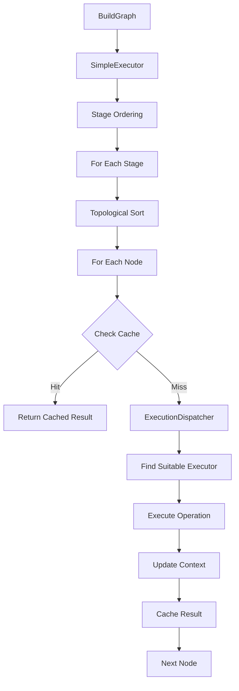

# ContainerBuildExecutor Architecture

## Overview

The ContainerBuildExecutor implements a clean, production-ready execution layer for ContainerBuildIR using the **Executor Pattern** rather than a complex scheduler.

## Architecture

### Core Components

1. **BuildExecutor** - The main orchestrator that executes complete build graphs
2. **OperationExecutor** - Executes individual operations (pluggable for different operation types)
3. **ExecutionContext** - Carries mutable state through the build process
4. **ExecutionDispatcher** - Routes operations to appropriate executors based on capabilities
5. **BuildCache** - Caches operation results to avoid redundant work
6. **Snapshotter** - Manages filesystem snapshots for layer creation

### Design Principles

- **Simplicity** - Clean interfaces with minimal complexity
- **Extensibility** - Easy to add new operation types and executors
- **Performance** - Parallel execution where possible, with efficient caching
- **Type Safety** - Leverages Swift's type system for correctness

## Execution Flow



## Capability-Based Routing

The dispatcher matches operations to executors based on:

1. **Operation Type** - Does the executor support this operation kind?
2. **Platform** - Can the executor handle the target platform?
3. **Privileges** - Does the executor have required privileges?
4. **Resources** - Are resource requirements satisfied?

## Concurrency Model

### Stage-Level Execution

Stages are executed sequentially to respect dependencies:

```swift
for stage in graph.stagesInDependencyOrder() {
    let context = ExecutionContext(stage: stage, ...)
    let snapshot = try await executeStage(stage, context: context)
    stageSnapshots[stage.name] = snapshot
}
```

### Node-Level Parallelism

Within a stage, independent nodes execute concurrently:

```swift
let levels = try GraphTraversal.topologicalLevels(stage)
for level in levels {
    await withTaskGroup(of: ExecutionResult.self) { group in
        for node in level {
            group.addTask {
                try await executeNode(node, context)
            }
        }
    }
}
```

## State Management

### Snapshot Evolution

Each operation produces a new filesystem snapshot:

```
Initial Snapshot (S0)
    ↓
Operation 1 → Snapshot S1
    ↓
Operation 2 → Snapshot S2
    ↓
Operation 3 → Snapshot S3 (Final)
```

### Environment Propagation

Environment changes cascade through operations:

```swift
context.updateEnvironment(["FOO": .literal("bar")])
// This update is visible to all subsequent operations in the stage
```

## Caching Strategy

### Cache Key Generation

Cache keys include:
- Operation digest (content hash)
- Input digests (from dependencies)
- Platform identifier
- Additional context

### Cache Lookup Flow

1. Compute cache key for operation
2. Check cache for existing result
3. If hit: skip execution, use cached result
4. If miss: execute operation, store result

## Error Handling

Errors are categorized and handled appropriately:

- **Unsupported Operations** - No executor can handle the operation
- **Resource Constraints** - Requirements cannot be satisfied
- **Execution Failures** - Operation failed during execution
- **Cancellation** - Build was cancelled by user

## Extensibility Points

### Adding New Operation Types

1. Define the operation in ContainerBuildIR
2. Create a specific executor implementing `OperationExecutor`
3. Register the executor with the dispatcher

### Custom Caching

Implement the `BuildCache` protocol:

```swift
public protocol BuildCache: Sendable {
    func get(_ key: CacheKey, for operation: Operation) async -> CachedResult?
    func put(_ result: ExecutionResult, key: CacheKey, for operation: Operation) async
}
```

### Alternative Snapshotters

Implement the `Snapshotter` protocol for different backends:

```swift
public protocol Snapshotter: Sendable {
    func createSnapshot(from parent: Snapshot?, applying changes: FilesystemChanges) async throws -> Snapshot
    func prepare(_ snapshot: Snapshot) async throws -> SnapshotHandle
}
```

## Performance Considerations

1. **Lazy Snapshot Creation** - Only create snapshots when filesystem changes occur
2. **Parallel Execution** - Maximize concurrency within dependency constraints
3. **Efficient Caching** - Cache keys designed for fast lookup
4. **Resource Pooling** - Reuse expensive resources like container instances

## Future Enhancements

1. **Distributed Execution** - Execute operations across multiple machines
2. **Incremental Builds** - Skip unchanged portions of the graph
3. **Progress Reporting** - Real-time feedback during execution
4. **Resource Monitoring** - Track CPU, memory, and I/O usage